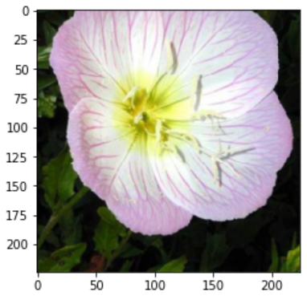
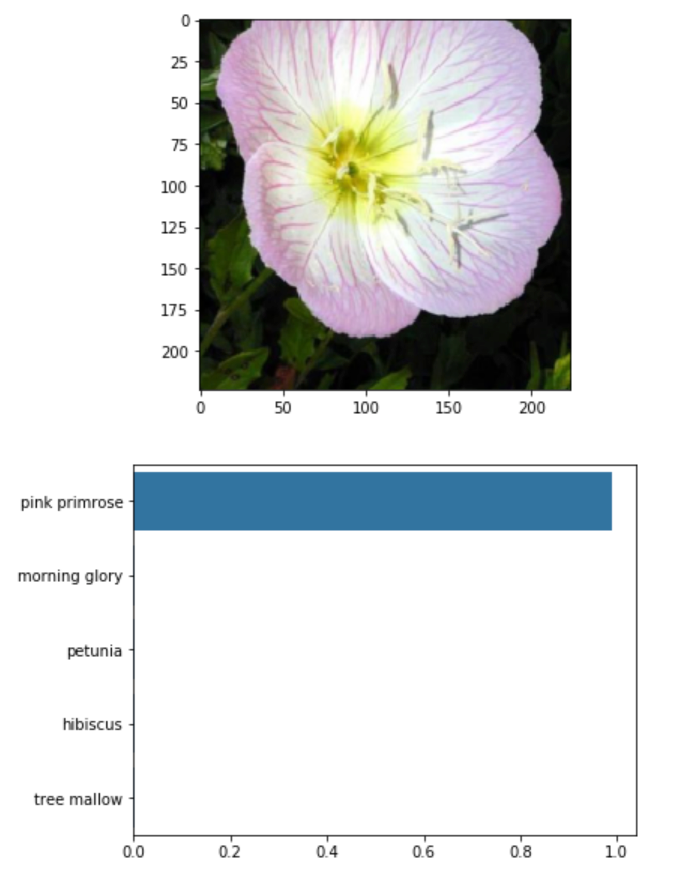

# Data Scientist Nanodegree

## Deep Learning

## Project: Image Classification with PyTorch

## Table of Contents

- [Part 1: Developing an AI Application](#p1)
  - [Loading the Data](#load_data)
  - [Label Mapping](#label_map)
  - [Building and Training the Classifier](#build_train)
  - [Testing the Network](#test)
  - [Save the Checkpoint](#save_ckp)
  - [Loading the Checkpoint](#load_ckp)
  - [Inference for Classification](#infer)
    - [Image Preprocessing](#img_prep)
    - [Class Prediction](#class_pred)
    - [Sanity Checking](#sanity_ck)
- [Part 2: Command Line App](#p2)
  - [Specifications](#specs)
- [Files](#files)
- [Running](#run)
- [Software and Libraries](#sw_lib)

***

<a id="p1"></a>

## Part 1: Developing an AI Application

Going forward, AI algorithms will be incorporated into more and more everyday applications. For example, we might want to include an image classifier in a smart phone app. To do this, we'd use a **deep learning** model trained on hundreds of thousands of images as part of the overall application architecture. A large part of software development in the future will be using these types of models as common parts of applications.

In this project, we'll train an image classifier to recognize different species
of flowers. We can imagine using something like this in a phone app that tells
us the name of the flower our camera is looking at. I'll train this classifier
in a Jupyter Notebook, then export it for use in my application. I'll be using
[this dataset](http://www.robots.ox.ac.uk/~vgg/data/flowers/102/index.html) of
102 flower categories, you can see a few examples below.


In this first part of the project, we'll work through a Jupyter notebook to
implement an image classifier with PyTorch.

If you want to try this project on your own (from scratch) then you can find the
files [on GitHub here](https://github.com/udacity/aipnd-project).

This first part is broken down into multiple steps:

- **Load** and **preprocess** the image dataset
- **Train** the image classifier on our dataset
- Use the trained classifier to **predict** image content

When we've completed this project, we'll have an application that can be trained
on any set of labeled images. Here the network will be learning about flowers and
end up as a **command line application**. But, what you do with your new skills
depends on your imagination and effort in building a data set. For example,
imagine an app where you take a picture of a car, it tells you what the make and
model is, then looks up information about it. Go try building your own data set and
make something new.

<a id="load_data"></a>

### Loading the Data

Here I'll use `torchvision` to load the data
([documentation](https://pytorch.org/docs/0.3.0/torchvision/index.html)).Data is
present in _flowers_ directory, still you can download it from
[here](https://s3.amazonaws.com/content.udacity-data.com/nd089/flower_data.tar.gz)
too.

The dataset is split into three parts: **training, validation** and **testing.**

For the training, I'll apply transformations such as random scaling, cropping
and flipping. This will help the network generalise leading to a better
performance. I'll also make sure the input data is resized to **224x224** as
required by the **pre-trained** networks.

The validation and testing sets are used to measure the model's performance on
data it hasn't seen yet. For this, I won't be applying scaling or rotation
transformations, but will resize then crop the images to the appropriate size.

<a id="label_map"></a>

### Label Mapping

I'll also load in a mapping from **category label** to **category name.** You
can find this in the file `cat_to_name.json`. It's a JSON object which you can
read in with the `json` [module](https://docs.python.org/2/library/json.html).
This will give you a dictionary mapping the integer encoded categories to the
actual names of the flowers.

<a id="build_train"></a>

### Building and Training the Classifier

Now that the data is ready, now I'll build and train the classifier. As usual, I
will use `vgg16` from `torchvision.models` to get the image features. Then I'll
build and train a new feed-forward classifier using those features.

#### Step 1. Load a pre-trained network

Build and train a pre-trained network:

```python
model = models.vgg16(pretrained = True)
```

Freeze the model's parameters so that we don't propagate through them:
```python
for param in model.parameters():
    param.requires_grad = False
```

#### Step 2. Define a new, untrained feed-forward network as a classifier, using ReLU activations and dropout

```python
from torch import nn
classifier = nn.Sequential(OrderedDict([
    ('fc1', nn.Linear(25088, 4096)),
    ('relu1', nn.ReLU()),
    ('fc6', nn.Linear(4096, 102)),
    ('output', nn.LogSoftmax(dim=1))
]))

model.classifier = classifier

model.to(device)
```

The last part will load the model on GPU if you have set it as default in the
starting of the notebook.

#### Step 3. Train the classifier layers using backpropagation using the pre-trained network to get the features

Evaluation metric:
```python
from torch import nn
criterion = nn.CrossEntropyLoss()
```

Optimizer:
```python
from torch import optim
optimizer = optim.Adam(model.classifier.parameters(), lr = 0.0001)
```

#### Step 4. Track the loss and accuracy on the validation set to determine the best hyperparameters

<a id="test"></a>

### Testing the Network

It's good practice to test the trained network on test data, images the network
has **never** seen either in training or validation. This will give a good estimate
for the model's performance on completely new images. Running  the test images
through the network and measuring the accuracy provided an **accuracy of 86%**.

<a id="save_ckp"></a>

### Save the Checkpoint

Now that the network is trained, I'll save the model so that I can load it later
for making predictions. I also want to save other things such as the mapping of
**classes** to **indices** which I can get from one of the image datasets:
`image_datasets['train'].class_to_idx`. I will attach this to the model as an
attribute which will make inference easier later on.

I'll want to completely rebuild the model later so I can use it for inference,
so I will include any information I need in the checkpoint.

If I want to load
the model and keep training, I'll need to save the number of epochs as well as
the optimizer state, `optimizer.state_dict`. I'll definitely use this trained
model in Part 2, so it is best to save now.

<a id="attr"></a>

```python
# save the checkpoint
model.class_to_idx = train_set.class_to_idx

# saving architecture, label-mapping, optimizer state and model classifier
checkpoint = {
    "arch": "vgg16",
    "class_to_idx": model.class_to_idx,
    "state_dict": model.state_dict(),
    "classifier": model.classifier
}

torch.save(checkpoint, "checkpoint.pth")
```

<a id="load_ckp"></a>

### Loading the Checkpoint

I built a function to load the checkpoint so that whenever I start a new
session, I won't need to retrain the network.

```python
# write a function that loads a checkpoint and rebuilds the model
import torch
from torchvision import models
def load_checkpoint(filepath):
    ckp = torch.load(filepath)
    model = models.vgg16(pretrained = True)

    for param in model.parameters():
        param.requires_grad = False

    model.classifier = ckp["classifier]
    model.load_state_dict(ckp["state_dict"])
    model.class_to_idx = ckp["class_to_idx"]
    model.to(device)

    return model
```

Loading my trained model from checkpoint looks like this:

```python
>>>load_checkpoint("checkpoint.pth")
VGG(
  (features): Sequential(
    (0): Conv2d(3, 64, kernel_size=(3, 3), stride=(1, 1), padding=(1, 1))
    (1): ReLU(inplace)
    (2): Conv2d(64, 64, kernel_size=(3, 3), stride=(1, 1), padding=(1, 1))
    (3): ReLU(inplace)
    (4): MaxPool2d(kernel_size=2, stride=2, padding=0, dilation=1, ceil_mode=False)
    (5): Conv2d(64, 128, kernel_size=(3, 3), stride=(1, 1), padding=(1, 1))
    (6): ReLU(inplace)
    (7): Conv2d(128, 128, kernel_size=(3, 3), stride=(1, 1), padding=(1, 1))
    (8): ReLU(inplace)
    (9): MaxPool2d(kernel_size=2, stride=2, padding=0, dilation=1, ceil_mode=False)
    (10): Conv2d(128, 256, kernel_size=(3, 3), stride=(1, 1), padding=(1, 1))
    (11): ReLU(inplace)
    (12): Conv2d(256, 256, kernel_size=(3, 3), stride=(1, 1), padding=(1, 1))
    (13): ReLU(inplace)
    (14): Conv2d(256, 256, kernel_size=(3, 3), stride=(1, 1), padding=(1, 1))
    (15): ReLU(inplace)
    (16): MaxPool2d(kernel_size=2, stride=2, padding=0, dilation=1, ceil_mode=False)
    (17): Conv2d(256, 512, kernel_size=(3, 3), stride=(1, 1), padding=(1, 1))
    (18): ReLU(inplace)
    (19): Conv2d(512, 512, kernel_size=(3, 3), stride=(1, 1), padding=(1, 1))
    (20): ReLU(inplace)
    (21): Conv2d(512, 512, kernel_size=(3, 3), stride=(1, 1), padding=(1, 1))
    (22): ReLU(inplace)
    (23): MaxPool2d(kernel_size=2, stride=2, padding=0, dilation=1, ceil_mode=False)
    (24): Conv2d(512, 512, kernel_size=(3, 3), stride=(1, 1), padding=(1, 1))
    (25): ReLU(inplace)
    (26): Conv2d(512, 512, kernel_size=(3, 3), stride=(1, 1), padding=(1, 1))
    (27): ReLU(inplace)
    (28): Conv2d(512, 512, kernel_size=(3, 3), stride=(1, 1), padding=(1, 1))
    (29): ReLU(inplace)
    (30): MaxPool2d(kernel_size=2, stride=2, padding=0, dilation=1, ceil_mode=False)
  )
  (classifier): Sequential(
    (fc1): Linear(in_features=25088, out_features=4096, bias=True)
    (relu1): ReLU()
    (fc6): Linear(in_features=4096, out_features=102, bias=True)
    (output): LogSoftmax()
  )
)
```

<a id="infer"></a>

### Inference for Classification

Now I'll write a function to use a trained network for inference. That is, I'll
pass an image into the network and predict the class of the flower in the image.
I need to write a function called predict that takes an **image** and a **model,** then returns
the **top K**  most likely classes along with the **probabilities.** It should look
like

```python
>>> probs, classes = predict(image_path, model)
>>> print(probs)
[ 0.01558163  0.01541934  0.01452626  0.01443549  0.01407339]
>>> print(classes)
['70', '3', '45', '62', '55']
```

First I'll need to handle processing the input image such that it can be used in
my network.

<a id = "infer"></a>

### Inference for Classification
<a id = "img_prep"></a>

#### Image Preprocessing

I'll need to use PIL to load the image ([documentation](https://pillow.readthedocs.io/en/latest/reference/Image.html)). It's best to write a function that preprocesses the image so it can be used as input for the model. This function should process the images in the same manner used for training.

First, resize the images where the shortest side is 256 pixels, keeping the aspect ratio. This can be done with the [`thumbnail`](https://pillow.readthedocs.io/en/3.1.x/reference/Image.html#PIL.Image.Image.thumbnail) or [`resize`](https://pillow.readthedocs.io/en/3.1.x/reference/Image.html#PIL.Image.Image.thumbnail) methods. Then I'll crop out the center 224x224 portion of the image.

Color channels of images are typically encoded as integers 0-255, but the model expected floats 0-1. I'll convert the values.

As before, the network expects the images to be normalized in a specific way. For the means, it's `[0.485, 0.456, 0.406]` and for the standard deviations `[0.229, 0.224, 0.225]`. I'll subtract the means from each color channel, then divide by the standard deviation.

And finally, PyTorch expects the color channel to be the first dimension but
it's the third dimension in the PIL image and Numpy array. I'll reorder
dimensions using `ndarray.transpose`. The color channel needs to be first and
retain the order of the other two dimensions.

```python
def process_image(image_path):
    """
    Args:
    1. image_path: Complete path of the image file which will be converted to numpy array

    Processes and converts image file to numpy array
    """
    # Process a PIL image for use in a PyTorch model
    image_transforms = transforms.Compose([
        transforms.Resize(256),
        transforms.CenterCrop(224),
        transforms.ToTensor()])

    # open the image_file
    pil = Image.open(image_path)

    # apply the transforms
    pil = image_transforms(pil).float()

    # convert to numpy array
    np_ = np.array(pil)

    # pre-specified mean and std for color channels in PyTorch
    mean = np.array([0.485, 0.456, 0.406])
    std = np.array([0.229, 0.224, 0.225])

    # normalise the color channels in transformed image
    np_ = (np.transpose(np_, (1, 2, 0)) - mean)/std
    np_ = np.transpose(np_, (2, 0, 1))

    return np_
```

To check my work, the function below converts a PyTorch tensor and displays it in the notebook. If `process_image` function works, running the output through this function should return the original image (except for the cropped out portions).

```python
def imshow(image, ax=None, title=None):

    if ax is None:
        fig, ax = plt.subplots()

    # PyTorch tensors assume the color channel is the first dimension
    # but matplotlib assumes is the third dimension
    image = image.transpose((1, 2, 0)) # 2 and 0 are swapped

    # Undo preprocessing
    mean = np.array([0.485, 0.456, 0.406])
    std = np.array([0.229, 0.224, 0.225])
    image = std * image + mean

    # Image needs to be clipped between 0 and 1 or it looks like noise when displayed
    image = np.clip(image, 0, 1)

    ax.imshow(image)

    return ax
```

```python
>>>imshow(process_image("flowers/test/1/image_06743.jpg"));
```


<a id = "class_pred"></a>

#### Class Prediction

Once we can get images in the correct format, it's time to write a function for
making predictions with our model. A common practice is to predict the top 5 or
so (usually called top-K) most probable classes. I'll calculate the class
probabilities then find the K largest values.

To get the top K largest values in a tensor I'll use `x.topk(k)`. This method
returns both the highest k probabilities and the indices of those probabilities
corresponding to the classes. I'll convert from these indices to the actual
class labels using `class_to_idx` which we added to the model as an
attribute([see here](#attr)).
We'll then invert the dictionary to get a mapping from index to class as well.

Again, this method will take a path to an image and a model checkpoint, then
return the probabilities and classes. Here is how the function will output results.

```python
>>> probs, classes = predict(image_path, model)
>>> print(probs)
[ 0.01558163  0.01541934  0.01452626  0.01443549  0.01407339]
>>> print(classes)
['70', '3', '45', '62', '55']
```

Now, let's see the action on a test image.

```python
>>> predict("flowers/test/1/image_06743.jpg", model = model, top_num=5)
([0.9902989864349365,
  0.002102087251842022,
  0.0020295947324484587,
  0.001994472462683916,
  0.0013319903519004583],
 ['1', '76', '51', '83', '86'],
 ['pink primrose', 'morning glory', 'petunia', 'hibiscus', 'tree mallow'])
```

<a id = "sanity_ck"></a>

#### Sanity Checking

Now that we are able to make predictions, let's visualise the results to
confirm. Even if the testing accuracy is high, it's always good to check that
there aren't obvious bugs. We'll use `matplotlib` to plot the probabilities for
the top 5 classes as a bar graph, along with the input image. It looks
like this:



## Part 2: Command Line App

Now that I've built and trained a deep neural network on the flower data set,
it's time to convert it into an application that others can use. This
application will be a pair of Python scripts that run from the command line. For
testing, I'll use the checkpoint I saved in the first part.

<a id="specs"></a>

### Specifications

For the command line application part we have two files, `train.py` and
`predict.py`. The first file, `train.py`, will train a new network on a dataset
and save the model as a checkpoint. The second file, `predict.py`, uses a
trained network to predict the class for an input image. 

- `train.py`

- `test.py`

<a id="files"></a>

## Files
<pre>
.
├── Image Classifier Project.ipynb---# BUILD AND TRAIN MODEL FOR PART I
├── assets---------------------------# REFERENCE IMAGES USED IN THE NOTEBOOK
├── cat_to_name.json-----------------# FLOWERS ID TO CLASS LABEL MAPPER
├── flowers--------------------------# DATA DIRECTORY
│   ├── test-------------------------# TEST DATA
│   ├── train------------------------# TRAIN DATA
│   └── valid------------------------# VALIDATION DATA
├── predict.py-----------------------# RUN THIS SCRIPT (WITH EXTERNAL ARGUMENTS)
                                       TO PREDICT ANY LABELLED IMAGE FROM TEST
                                       DIRECTORY
└── train.py-------------------------# RUN THIS SCRIPT (WITH EXTERNAL ARGUMENTS)
                                       TO TRAIN THE MDOEL AND SAVE THE CHECKPOINT
</pre>

<a id="run"></a>

## Running

<a id="sw_lib"></a>

## Software and Libraries

This project uses Python 3.6.3 and the necessary libraries are mentioned in _requirements.txt_